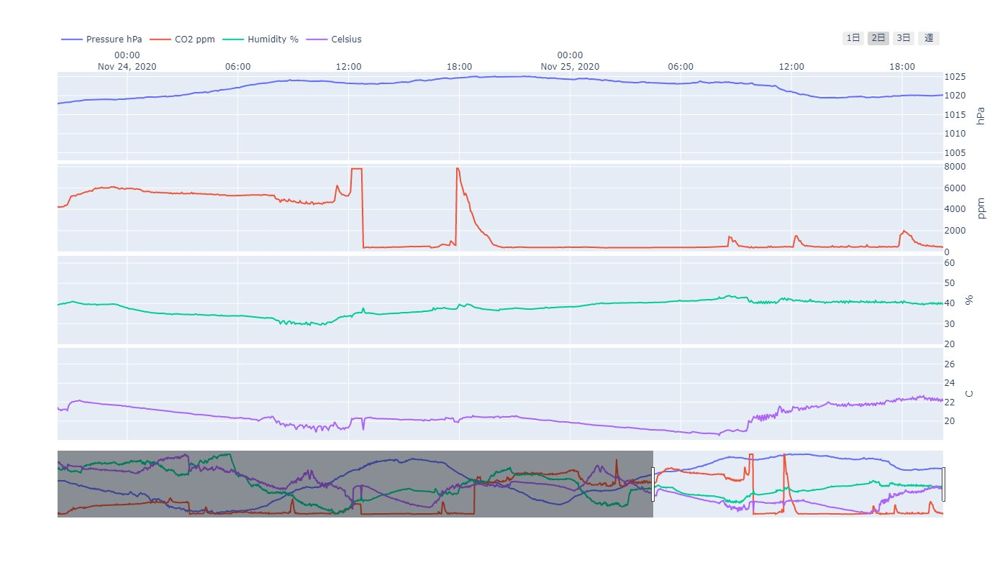

# CCS811/BME280 on Raspberry PI 4

CCS811とBME280をI2Cで接続して、値を読む。

* CCS811: 等価CO2濃度と総揮発性ガス濃度を測定できる
* BME280: 温度、湿度、気圧を測定できる

## Check I2C connection

`i2c-tools`が必要。これで接続を確認する。
CCS811は0x5B(default)、BME280は0x77(default)にあるはず。うまく見えると以下のようになる。

```sh
$ sudo apt install i2c-tools
$ ls /dev/i2c*
/dev/i2c-1
$ sudo i2cdetect -y 1
     0  1  2  3  4  5  6  7  8  9  a  b  c  d  e  f
00:          -- -- -- -- -- -- -- -- -- -- -- -- --
10: -- -- -- -- -- -- -- -- -- -- -- -- -- -- -- --
20: -- -- -- -- -- -- -- -- -- -- -- -- -- -- -- --
30: -- -- -- -- -- -- -- -- -- -- -- -- -- -- -- --
40: -- -- -- -- -- -- -- -- -- -- -- -- -- -- -- --
50: -- -- -- -- -- -- -- -- -- -- -- 5b -- -- -- --
60: -- -- -- -- -- -- -- -- -- -- -- -- -- -- -- --
70: -- -- -- -- -- -- -- 77
```

接続を確認できたら、ハードウェアIDを確認してちゃんと動いているか確認。

```bash
#!/bin/bash

CCS811="0x5b"
BME280="0x77"
I2C_BUS="1"

# CCS811
# https://cdn.sparkfun.com/assets/learn_tutorials/1/4/3/CCS811_Datasheet-DS000459.pdf

ccs811_hw_id=$(i2cget -y ${I2C_BUS} ${CCS811} 0x20)
ccs811_hw_version=$(i2cget -y ${I2C_BUS} ${CCS811} 0x21)
# ccs811_fw_boot_version=$(i2cget -y ${I2C_BUS} ${CCS811} 0x23 w)
# ccs811_fw_app_version=$(i2cget -y ${I2C_BUS} ${CCS811} 0x24 w)

echo "CCS811 HW_ID: ${ccs811_hw_id} HW Version ${ccs811_hw_version}"
# echo "FW Boot Version ${ccs811_fw_boot_version}"
# echo "FW app  Version ${ccs811_fw_app_version}"

# BME280
# https://cdn.sparkfun.com/assets/learn_tutorials/4/1/9/BST-BME280_DS001-10.pdf

bme280_hw_id=$(i2cget -y ${I2C_BUS} ${BME280} 0xd0)
echo "BME280 HW_ID: ${bme280_hw_id}"
```

## Read the sensor values

I2Cのデバイスは`/dev/i2c-1`みたいな感じの場所にいるが、アクセスするのに管理者権限が必要なので、自分を`i2c`というグループに登録しておく。
こうしておくと管理者権限無しでI2Cデバイスにアクセスできる。

```sh
sudo usermod -aG i2c $USER
```

こんかいはPythonを使いたいのでPythonからI2Cデバイスにアクセスできる`smbus2`をインストールする。

```sh
pip install smbus2
```

このリポジトリのコードを使うと以下のようにセンサの値を取得できる。

* これらのコードをインポートして使う
     - [`bme280.py`](https://github.com/nv-h/i2c_env_sensors/blob/master/bme280.py)
     - [`ccs811.py`](https://github.com/nv-h/i2c_env_sensors/blob/master/ccs811.py)

```python
from bme280 import BME280

bme280 = BME280()
p, t, h = bme280.get()
print(f"{p:7.2f} hPa, {t:6.2f} C, {h:5.2f} %")

from ccs811 import CCS811

ccs811 = CCS811()
ccs811.compensate(h, t) # if needed
voc, co2 = ccs811.get() # May need to exec several times to get correct values
print(f"TVOC:{voc:4d} ppb, eCO2:{co2:4d} ppm")
```

## Example

### Command Line

[`example.py`](https://github.com/nv-h/i2c_env_sensors/blob/master/example.py)にコマンドラインの例を示す。
このコードは、標準出力に1秒毎にセンサで取得した値を吐く。
たまにOSErrorになるが、気にしていない。あと、CO2濃度はしばらく経たないとちゃんとした値にならない。
データシートによると20分位は安定しないのと、48時間のエージングが必要らしい。

```python
#!/usr/bin/env python

from time import sleep
from bme280 import BME280
from ccs811 import CCS811

ccs811 = CCS811()
bme280 = BME280()
p, t, h = bme280.get()
ccs811.compensate(h, t)

while(True):
    try:
        p, t, h = bme280.get()
        voc, co2 = ccs811.get()
        print(f"{p:7.2f} hPa, {t:6.2f} C, {h:5.2f} %, TVOC:{voc:4d} ppb, eCO2:{co2:4d} ppm")
        sleep(1)
    except OSError:
        # i2c bus somtimes cannot access
        continue
    except KeyboardInterrupt:
        break
```

### GUI (matplotlib)

[`example_gui.py`](https://github.com/nv-h/i2c_env_sensors/blob/master/example_gui.py)にmatplotlibでのGUI表示の例を示す。
このコードでは0.2秒毎にグラフを更新している。特に意味はないが高速に動かすと動いている感が得られる。
([PythonでGUI画面とリアルタイムグラフ表示する](https://qiita.com/nv-h/items/92feeb34338c09c6d2a2)の成果を流用)

* 必要なパッケージ: `pip install matplotlib numpy`


### GUI (dash)

[`save_csv.py`](https://github.com/nv-h/i2c_env_sensors/blob/master/save_csv.py)で1分ごとにデータ取得して、[`dash_from_csv.py`](https://github.com/nv-h/i2c_env_sensors/blob/master/dash_from_csv.py)でそれをWeb UIで表示する。
表示には[dash](https://dash.plotly.com/)を使用した。

* 必要なパッケージ: `pip install dash pandas numpy`
* 注意:
     - 温度: 基板の発熱があるのでセンサの値から-2℃しているが、環境によって変わると思う。
     - Time-zone: Asia/Tokyo (UTC -9 hours)に固定している。



無限にCSVファイルに追記することになるが、読み込みより表示のほうが大幅に負荷が大きいため表示データを1周間ごとに制限している。
さらにデータの個数は間引きして表示している。(1分間隔なんて高頻度に取得するなってことだけど、デモだとたくさん待たないといけないので...)

* 知見
    - dashはコードを変更すると動的に表示が更新されて楽しい
    - Rasberry PIでdashは重すぎるかと思ったけど割とサクサク
    - pandas初めて触ったけどめっちゃ便利なので活用したい
